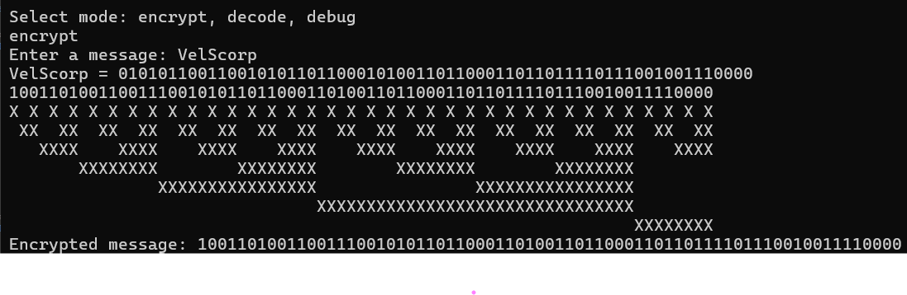
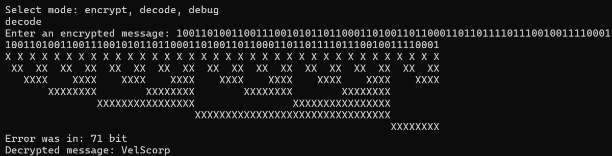

# HammingCode

HammingCode is a C# implementation of Hamming code, a linear error-correcting code used for error detection and correction in data transmission.

## Overview

Hamming codes are fundamental in telecommunications, computer memory systems, and other domains where data integrity is crucial. This repository offers a concise yet robust implementation of Hamming code in C#, providing a straightforward solution for error detection and correction.

## Screenshots

### Encoding Example


### Decoding Example


## Features

- **Encoding**: Convert input data bits into Hamming-coded bits.
- **Decoding**: Convert Hamming-coded bits into data bits.
- **Error Detection**: Identify and locate single-bit errors.
- **Error Correction**: Fix detected errors using redundancy bits.

## Usage

1. **Clone the repository:**

```bash
git clone https://github.com/VelSkorp/HammingCode.git
```

2. Open the solution file HammingCode.sln in Visual Studio or any compatible C# IDE.

3. Build the solution.

4. Run the application.

5. Follow the on-screen instructions to encode and decode data using Hamming code.

## Contributions

Contributions are welcome! Feel free to submit issues or pull requests.

## License

This project is licensed under the MIT License.
